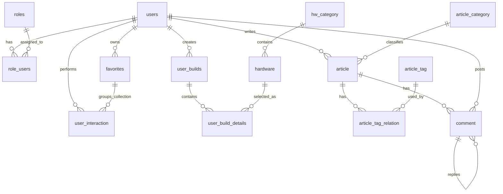

# NepForge 数据库设计文档

> 文档状态：基于当前 `schema.sql` 固化生成，不修改表结构。  
> 数据库名：`nep_forge`  
> 适用项目：Spring Boot + Vue 3 装机与数码产品社区网站  
> 生成日期：2026-05-30

---

## 1. 设计目标

NepForge 是一个面向电脑装机与数码产品信息管理的综合型网站。数据库设计围绕以下核心业务展开：

1. 用户注册、登录、角色权限管理；
2. 配件分类、配件信息、参数展示与对比；
3. 用户装机方案保存、公开展示；
4. 文章专栏、标签分类、评论交流；
5. 点赞、收藏夹、收藏内容访问；
6. 后续可扩展至更多数码产品和教学板块。

当前数据库采用模块化设计，将用户体系、配件库、装机单、论坛内容、用户互动拆分为相对独立的表结构，方便后续按业务模块进行 Spring Boot 分层开发。

---

## 2. 数据库基础配置

```sql
create database if not exists nep_forge
default character set utf8mb4
collate utf8mb4_unicode_ci;

use nep_forge;
```

### 2.1 字符集与排序规则

| 配置项 | 当前值 | 说明 |
|---|---|---|
| 数据库名 | `nep_forge` | 项目主数据库 |
| 字符集 | `utf8mb4` | 支持中文、Emoji、特殊符号 |
| 排序规则 | `utf8mb4_unicode_ci` | 通用 Unicode 排序规则 |
| 存储引擎 | `InnoDB` | 支持事务、行级锁、崩溃恢复 |

### 2.2 通用字段约定

多数业务表都采用以下通用字段：

| 字段 | 类型 | 说明 |
|---|---|---|
| `id` | `bigint unsigned` / `int unsigned` | 主键。核心业务表多使用雪花算法生成，字典类表使用自增 ID |
| `create_time` | `datetime` | 创建时间 |
| `update_time` | `datetime` | 更新时间 |
| `is_deleted` | `tinyint(1)` | 软删除标记，`0` 表示未删除，`1` 表示已删除 |

---

## 3. 模块划分

| 模块 | 表名 | 说明 |
|---|---|---|
| 用户模块 | `users` | 用户基础信息 |
| 用户模块 | `roles` | 系统角色 |
| 用户模块 | `role_users` | 用户与角色关联 |
| 用户模块 | `favorites` | 用户收藏夹 |
| 用户模块 | `user_interaction` | 点赞、收藏行为统一记录 |
| 配件库模块 | `hw_category` | 配件分类树 |
| 配件库模块 | `hardware` | 配件与数码产品信息 |
| 装机单模块 | `user_builds` | 装机单主表 |
| 装机单模块 | `user_build_details` | 装机单明细 |
| 用户论坛模块 | `article` | 文章/专栏内容 |
| 用户论坛模块 | `article_category` | 文章分类 |
| 用户论坛模块 | `article_tag` | 文章标签 |
| 用户论坛模块 | `article_tag_relation` | 文章与标签关联 |
| 用户论坛模块 | `comment` | 评论与楼中楼回复 |

---

## 4. 逻辑 ER 关系

当前 SQL 中没有显式声明外键，业务关系由字段命名、唯一索引和后端逻辑共同约束。这样可以降低初期开发复杂度，也方便后续做软删除和分模块维护。



### 4.1 主要关系说明

| 关系 | 类型 | 说明 |
|---|---|---|
| `users` - `role_users` - `roles` | 多对多 | 一个用户可拥有多个角色，一个角色可分配给多个用户 |
| `users` - `favorites` | 一对多 | 一个用户可创建多个收藏夹 |
| `users` - `user_interaction` | 一对多 | 一个用户可对文章、配件、装机单、评论执行点赞或收藏 |
| `hw_category` - `hardware` | 一对多 | 一个配件分类下可有多个配件 |
| `users` - `user_builds` | 一对多 | 一个用户可创建多个装机单 |
| `user_builds` - `user_build_details` | 一对多 | 一个装机单包含多个配件明细 |
| `hardware` - `user_build_details` | 一对多 | 一个配件可出现在多个装机单中 |
| `article_category` - `article` | 一对多 | 一个文章分类下可有多篇文章 |
| `article` - `article_tag` | 多对多 | 通过 `article_tag_relation` 建立文章标签关系 |
| `article` - `comment` | 一对多 | 一篇文章可有多条评论 |
| `comment` - `comment` | 自关联 | 通过 `parent_id` 实现楼中楼回复 |

---

## 5. 枚举值约定

### 5.1 用户状态

| 字段 | 值 | 含义 |
|---|---:|---|
| `users.status` | 0 | 禁用 |
| `users.status` | 1 | 正常 |
| `users.is_deleted` | 0 | 未删除 |
| `users.is_deleted` | 1 | 已删除 |

`users.status` 用于控制用户是否可登录，独立于 `is_deleted` 软删除标记。被禁用用户无法登录但数据保留；被删除用户标记 `is_deleted = 1`。

### 5.2 角色编码

| 角色编码 | 角色名称 | 说明 |
|---|---|---|
| `ROLE_USER` | 普通用户 | 注册后默认角色，可发帖、评论、点赞 |
| `ROLE_MODERATOR` | 版主 | 可管理评论，删除违规内容 |
| `ROLE_ADMIN` | 超级管理员 | 拥有所有权限 |

### 5.3 用户互动目标类型

| 字段 | 值 | 含义 |
|---|---:|---|
| `user_interaction.target_type` | 1 | 文章 |
| `user_interaction.target_type` | 2 | 配件 |
| `user_interaction.target_type` | 3 | 装机单 |
| `user_interaction.target_type` | 4 | 评论 |

### 5.4 用户互动行为类型

| 字段 | 值 | 含义 |
|---|---:|---|
| `user_interaction.action_type` | 1 | 点赞 |
| `user_interaction.action_type` | 2 | 收藏 |

### 5.5 装机单状态

| 字段 | 值 | 含义 |
|---|---:|---|
| `user_builds.status` | 0 | 草稿 |
| `user_builds.status` | 1 | 正常 |
| `user_builds.status` | 2 | 下架 |

### 5.6 文章状态

| 字段 | 值 | 含义 |
|---|---:|---|
| `article.status` | 0 | 草稿 |
| `article.status` | 1 | 已发布 |
| `article.status` | 2 | 已下架 |

### 5.7 评论状态

| 字段 | 值 | 含义 |
|---|---:|---|
| `comment.status` | 0 | 禁用 |
| `comment.status` | 1 | 正常 |

---

# 6. 表结构设计

---

## 6.1 用户表：`users`

### 表说明

`users` 用于保存系统用户的基础账号信息，包括用户名、密码哈希、邮箱、头像等。密码字段只保存加密后的哈希值，不保存明文密码。

### 字段设计

| 字段 | 类型 | 约束 | 默认值 | 说明 |
|---|---|---|---|---|
| `id` | `bigint unsigned` | PK | - | 用户 id，雪花算法生成 |
| `username` | `varchar(50)` | NOT NULL, UNIQUE | - | 用户名 |
| `password_hash` | `varchar(255)` | NOT NULL | - | 加密后的密码 |
| `email` | `varchar(100)` | NOT NULL, UNIQUE | - | 邮箱 |
| `nickname` | `varchar(50)` | NULL | `null` | 昵称 |
| `bio` | `varchar(255)` | NULL | `null` | 简介 |
| `avatar` | `varchar(512)` | NULL | `null` | 头像 URL |
| `status` | `tinyint unsigned` | NOT NULL | `1` | 用户状态，0 禁用，1 正常 |
| `last_login_time` | `datetime` | NULL | `null` | 最后登录时间 |
| `create_time` | `datetime` | NOT NULL | - | 创建时间 |
| `update_time` | `datetime` | NOT NULL | - | 更新时间 |
| `is_deleted` | `tinyint(1)` | NOT NULL | `0` | 是否删除 |

### 索引设计

| 索引名 | 字段 | 类型 | 说明 |
|---|---|---|---|
| `PRIMARY` | `id` | 主键 | 用户唯一标识 |
| `uk_username` | `username` | 唯一索引 | 防止用户名重复 |
| `uk_email` | `email` | 唯一索引 | 防止邮箱重复 |
| `idx_is_deleted_create_time` | `is_deleted`, `create_time` | 普通联合索引 | 查询未删除用户列表并按创建时间排序 |

---

## 6.2 角色表：`roles`

### 表说明

`roles` 用于保存系统角色。当前预置三种角色：普通用户、版主、超级管理员。

### 字段设计

| 字段 | 类型 | 约束 | 默认值 | 说明 |
|---|---|---|---|---|
| `id` | `int unsigned` | PK, AUTO_INCREMENT | - | 角色 id |
| `role_name` | `varchar(50)` | NOT NULL | - | 角色名称 |
| `role_code` | `varchar(50)` | NOT NULL, UNIQUE | - | 角色编码 |
| `description` | `varchar(255)` | NULL | `null` | 角色描述 |
| `create_time` | `datetime` | NOT NULL | - | 创建时间 |
| `update_time` | `datetime` | NOT NULL | - | 更新时间 |
| `is_deleted` | `tinyint(1)` | NOT NULL | `0` | 是否删除 |

### 索引设计

| 索引名 | 字段 | 类型 | 说明 |
|---|---|---|---|
| `PRIMARY` | `id` | 主键 | 角色唯一标识 |
| `uk_role_code` | `role_code` | 唯一索引 | 防止角色编码重复 |

### 预置数据

| role_name | role_code | description |
|---|---|---|
| 普通用户 | `ROLE_USER` | 注册后默认角色，可发帖、评论、点赞 |
| 版主 | `ROLE_MODERATOR` | 可管理评论，删除违规内容 |
| 超级管理员 | `ROLE_ADMIN` | 拥有所有权限 |

---

## 6.3 用户角色关联表：`role_users`

### 表说明

`role_users` 用于维护用户与角色之间的多对多关系。

### 字段设计

| 字段 | 类型 | 约束 | 默认值 | 说明 |
|---|---|---|---|---|
| `id` | `bigint unsigned` | PK, AUTO_INCREMENT | - | 主键 id |
| `user_id` | `bigint unsigned` | NOT NULL | - | 用户 id |
| `role_id` | `int unsigned` | NOT NULL | - | 角色 id |
| `create_time` | `datetime` | NOT NULL | - | 创建时间 |
| `update_time` | `datetime` | NOT NULL | - | 更新时间 |

### 索引设计

| 索引名 | 字段 | 类型 | 说明 |
|---|---|---|---|
| `PRIMARY` | `id` | 主键 | 关联记录唯一标识 |
| `uk_user_role` | `user_id`, `role_id` | 唯一索引 | 确保同一用户不能重复分配同一角色 |
| `idx_user_id` | `user_id` | 普通索引 | 加速查询用户角色 |

---

## 6.4 收藏夹表：`favorites`

### 表说明

`favorites` 用于保存用户创建的收藏夹。用户可以创建多个收藏夹，并设置公开或私密。

### 字段设计

| 字段 | 类型 | 约束 | 默认值 | 说明 |
|---|---|---|---|---|
| `id` | `bigint unsigned` | PK | - | 收藏夹 id，雪花算法生成 |
| `user_id` | `bigint unsigned` | NOT NULL | - | 创建该收藏夹的用户 id |
| `name` | `varchar(50)` | NOT NULL | - | 收藏夹名称 |
| `description` | `varchar(255)` | NULL | `null` | 收藏夹描述 |
| `is_public` | `tinyint(1)` | NOT NULL | `0` | 是否公开，0 私密，1 公开 |
| `create_time` | `datetime` | NOT NULL | - | 收藏夹创建时间 |
| `update_time` | `datetime` | NOT NULL | - | 收藏夹更新时间 |

> 说明：当前 `favorites` 表未设计 `is_deleted` 软删除字段。删除收藏夹为物理删除，同时由后端清理 `user_interaction` 中关联的收藏记录。

### 索引设计

| 索引名 | 字段 | 类型 | 说明 |
|---|---|---|---|
| `PRIMARY` | `id` | 主键 | 收藏夹唯一标识 |
| `idx_user_id` | `user_id` | 普通索引 | 加速查询用户收藏夹 |
| `uk_user_folder_name` | `user_id`, `name` | 唯一索引 | 同一用户下收藏夹名称不可重复 |

---

## 6.5 用户行为表：`user_interaction`

### 表说明

`user_interaction` 统一保存点赞和收藏行为。目标对象通过 `target_type + target_id` 表示，可指向文章、配件、装机单或评论。

### 字段设计

| 字段 | 类型 | 约束 | 默认值 | 说明 |
|---|---|---|---|---|
| `id` | `bigint unsigned` | PK | - | 交互 id，雪花算法生成 |
| `user_id` | `bigint unsigned` | NOT NULL | - | 用户 id |
| `target_id` | `bigint unsigned` | NOT NULL | - | 目标 id |
| `target_type` | `tinyint unsigned` | NOT NULL | - | 目标类型：1 文章，2 配件，3 装机单，4 评论 |
| `action_type` | `tinyint unsigned` | NOT NULL | - | 行为类型：1 点赞，2 收藏 |
| `folder_id` | `bigint unsigned` | NOT NULL | `0` | 收藏夹 id，收藏行为时填写 |
| `create_time` | `datetime` | NOT NULL | - | 创建时间 |
| `update_time` | `datetime` | NOT NULL | - | 更新时间 |

### 索引设计

| 索引名 | 字段 | 类型 | 说明 |
|---|---|---|---|
| `PRIMARY` | `id` | 主键 | 用户行为唯一标识 |
| `uk_interaction` | `user_id`, `target_id`, `target_type`, `action_type` | 唯一索引 | 防止同一用户对同一目标重复点赞或收藏 |
| `idx_target` | `target_id`, `target_type`, `action_type` | 普通联合索引 | 查询目标对象的点赞数、收藏数 |
| `idx_user_id` | `user_id` | 普通索引 | 查询用户的点赞/收藏记录 |

### 典型查询场景

| 场景 | 查询条件 |
|---|---|
| 判断用户是否点赞某文章 | `user_id + target_id + target_type=1 + action_type=1` |
| 查询某文章点赞列表 | `target_id + target_type=1 + action_type=1` |
| 查询用户收藏内容 | `user_id + action_type=2 + is_deleted=0` |
| 查询收藏夹内容 | `folder_id + action_type=2 + is_deleted=0` |

---

## 6.6 配件分类表：`hw_category`

### 表说明

`hw_category` 用于维护配件分类树。通过 `parent_id` 支持多级分类，根分类的 `parent_id = 0`。

### 字段设计

| 字段 | 类型 | 约束 | 默认值 | 说明 |
|---|---|---|---|---|
| `id` | `int unsigned` | PK, AUTO_INCREMENT | - | 分类 id |
| `name` | `varchar(50)` | NOT NULL | - | 分类名称 |
| `parent_id` | `int unsigned` | NOT NULL | `0` | 父级分类 id |
| `status` | `tinyint(1)` | NOT NULL | `1` | 分类状态，0 禁用，1 启用 |
| `sort_order` | `int unsigned` | NOT NULL | `0` | 排序值，数值越小越靠前 |
| `create_time` | `datetime` | NOT NULL | - | 创建时间 |
| `update_time` | `datetime` | NOT NULL | - | 更新时间 |
| `is_deleted` | `tinyint(1)` | NOT NULL | `0` | 是否删除 |

### 索引设计

| 索引名 | 字段 | 类型 | 说明 |
|---|---|---|---|
| `PRIMARY` | `id` | 主键 | 分类唯一标识 |
| `idx_parent_id` | `parent_id` | 普通索引 | 加速查询子分类 |

### 预置顶级分类

| 排序 | 分类名称 |
|---:|---|
| 1 | CPU 处理器 |
| 2 | 主板 |
| 3 | 内存 |
| 4 | 硬盘 |
| 5 | 显卡 |
| 6 | 电源 |
| 7 | 机箱 |
| 8 | 散热器 |
| 9 | 显示器 |
| 10 | 键盘 |
| 11 | 鼠标 |
| 12 | 其他配件 |

---

## 6.7 配件表：`hardware`

### 表说明

`hardware` 用于保存电脑配件和其他数码产品的信息。通用字段保存产品名称、品牌、价格、数据来源、发布时间、封面图等；差异化参数通过 `specs_json` 保存。

### 字段设计

| 字段 | 类型 | 约束 | 默认值 | 说明 |
|---|---|---|---|---|
| `id` | `bigint unsigned` | PK | - | 配件 id，雪花算法生成 |
| `category_id` | `int unsigned` | NOT NULL | - | 所属分类 id |
| `name` | `varchar(100)` | NOT NULL | - | 产品名称/型号 |
| `brand` | `varchar(50)` | NULL | `null` | 品牌 |
| `price` | `decimal(10,2)` | NOT NULL | `0.00` | 价格 |
| `source_name` | `varchar(100)` | NULL | `null` | 数据来源名称 |
| `source_url` | `varchar(512)` | NULL | `null` | 数据来源链接 |
| `release_date` | `date` | NULL | `null` | 发布时间 |
| `last_sync_time` | `datetime` | NULL | `null` | 最近同步时间 |
| `cover_image` | `varchar(512)` | NULL | `null` | 封面图片 URL |
| `specs_json` | `json` | NULL | `null` | 配件差异化参数，JSON 格式 |
| `create_time` | `datetime` | NOT NULL | - | 创建时间 |
| `update_time` | `datetime` | NOT NULL | - | 更新时间 |
| `is_deleted` | `tinyint(1)` | NOT NULL | `0` | 是否删除 |

### 索引设计

| 索引名 | 字段 | 类型 | 说明 |
|---|---|---|---|
| `PRIMARY` | `id` | 主键 | 配件唯一标识 |
| `idx_category_id` | `category_id` | 普通索引 | 查询分类下的配件 |
| `idx_brand` | `brand` | 普通索引 | 查询品牌下的配件 |
| `idx_category_deleted_price` | `category_id`, `is_deleted`, `price` | 普通联合索引 | 分类列表、过滤删除、按价格排序 |
| `idx_deleted_create_time` | `is_deleted`, `create_time` | 普通联合索引 | 查询未删除配件列表并按创建时间排序 |

### `specs_json` 示例

CPU 示例：

```json
{
  "cores": 8,
  "threads": 16,
  "baseClock": "3.8GHz",
  "boostClock": "5.1GHz",
  "socket": "AM5",
  "tdp": 105
}
```

显卡示例：

```json
{
  "gpuChip": "RTX 4070 SUPER",
  "memory": "12GB GDDR6X",
  "memoryBus": "192-bit",
  "tdp": 220,
  "interface": "PCIe 4.0"
}
```

---

## 6.8 装机单主表：`user_builds`

### 表说明

`user_builds` 用于保存用户创建的装机方案主信息。一份装机单可以是草稿、正常公开方案或已下架方案。

### 字段设计

| 字段 | 类型 | 约束 | 默认值 | 说明 |
|---|---|---|---|---|
| `id` | `bigint unsigned` | PK | - | 装机单 id，雪花算法生成 |
| `user_id` | `bigint unsigned` | NOT NULL | - | 创建该装机单的用户 id |
| `title` | `varchar(100)` | NOT NULL | - | 装机单标题 |
| `total_price` | `decimal(10,2)` | NOT NULL | `0.00` | 装机单总价 |
| `total_power` | `decimal(10,2)` | NOT NULL | `0.00` | 装机单总功耗 |
| `description` | `varchar(255)` | NULL | `null` | 装机单描述 |
| `is_public` | `tinyint(1)` | NOT NULL | `0` | 是否公开，0 私密，1 公开 |
| `status` | `tinyint` | NOT NULL | `0` | 状态，0 草稿，1 正常，2 下架 |
| `cover_image` | `varchar(512)` | NULL | `null` | 装机单封面图 |
| `create_time` | `datetime` | NOT NULL | - | 创建时间 |
| `update_time` | `datetime` | NOT NULL | - | 更新时间 |
| `is_deleted` | `tinyint(1)` | NOT NULL | `0` | 是否删除 |

### 索引设计

| 索引名 | 字段 | 类型 | 说明 |
|---|---|---|---|
| `PRIMARY` | `id` | 主键 | 装机单唯一标识 |
| `idx_user_id_deleted` | `user_id`, `is_deleted` | 普通联合索引 | 查询用户装机单 |
| `idx_public_status_create_time` | `is_public`, `status`, `is_deleted`, `create_time` | 普通联合索引 | 查询公开装机单列表 |

---

## 6.9 装机单详情表：`user_build_details`

### 表说明

`user_build_details` 用于保存装机单中的配件明细。同一装机单内同一配件只能出现一次，多件同款配件通过 `quantity` 表示。

### 字段设计

| 字段 | 类型 | 约束 | 默认值 | 说明 |
|---|---|---|---|---|
| `id` | `bigint unsigned` | PK | - | 装机单详情 id，雪花算法生成 |
| `build_id` | `bigint unsigned` | NOT NULL | - | 装机单 id |
| `hardware_id` | `bigint unsigned` | NOT NULL | - | 配件 id |
| `quantity` | `int unsigned` | NOT NULL | `1` | 配件数量 |
| `create_time` | `datetime` | NOT NULL | - | 创建时间 |
| `update_time` | `datetime` | NOT NULL | - | 更新时间 |

### 索引设计

| 索引名 | 字段 | 类型 | 说明 |
|---|---|---|---|
| `PRIMARY` | `id` | 主键 | 装机单详情唯一标识 |
| `uk_build_hardware` | `build_id`, `hardware_id` | 唯一索引 | 同一装机单内同一配件只能出现一次 |
| `idx_build_id` | `build_id` | 普通索引 | 查询装机单下的配件明细 |

---

## 6.10 文章表：`article`

### 表说明

`article` 用于保存用户发布的文章、专栏内容和装机指南。正文使用 `longtext` 存储 Markdown 原文。浏览量、点赞量、收藏量、评论量使用冗余字段存储，以提升列表页查询性能。

### 字段设计

| 字段 | 类型 | 约束 | 默认值 | 说明 |
|---|---|---|---|---|
| `id` | `bigint unsigned` | PK | - | 文章 id，雪花算法生成 |
| `category_id` | `int unsigned` | NULL | `null` | 文章分类 id |
| `user_id` | `bigint unsigned` | NOT NULL | - | 作者 id |
| `title` | `varchar(255)` | NOT NULL | - | 标题 |
| `content` | `longtext` | NOT NULL | - | 文章内容，Markdown 格式 |
| `status` | `tinyint(1)` | NOT NULL | `0` | 文章状态，0 草稿，1 已发布，2 已下架 |
| `view_count` | `int unsigned` | NOT NULL | `0` | 浏览量 |
| `like_count` | `int unsigned` | NOT NULL | `0` | 点赞量 |
| `favorite_count` | `int unsigned` | NOT NULL | `0` | 收藏量 |
| `comment_count` | `int unsigned` | NOT NULL | `0` | 评论量 |
| `create_time` | `datetime` | NOT NULL | - | 创建时间 |
| `update_time` | `datetime` | NOT NULL | - | 更新时间 |
| `is_deleted` | `tinyint(1)` | NOT NULL | `0` | 是否删除 |

### 索引设计

| 索引名 | 字段 | 类型 | 说明 |
|---|---|---|---|
| `PRIMARY` | `id` | 主键 | 文章唯一标识 |
| `idx_user_id` | `user_id` | 普通索引 | 查询作者文章 |
| `idx_deleted_create_time` | `is_deleted`, `create_time` | 普通联合索引 | 查询未删除文章列表 |
| `idx_status_deleted_create_time` | `status`, `is_deleted`, `create_time` | 普通联合索引 | 查询已发布文章列表 |

---

## 6.11 文章分类表：`article_category`

### 表说明

`article_category` 用于维护文章分类。分类名称不允许重复。

### 字段设计

| 字段 | 类型 | 约束 | 默认值 | 说明 |
|---|---|---|---|---|
| `id` | `int unsigned` | PK, AUTO_INCREMENT | - | 文章分类 id |
| `name` | `varchar(50)` | NOT NULL, UNIQUE | - | 分类名称 |
| `sort_order` | `int unsigned` | NOT NULL | `0` | 排序值 |
| `create_time` | `datetime` | NOT NULL | - | 创建时间 |
| `update_time` | `datetime` | NOT NULL | - | 更新时间 |
| `is_deleted` | `tinyint(1)` | NOT NULL | `0` | 是否删除 |

### 索引设计

| 索引名 | 字段 | 类型 | 说明 |
|---|---|---|---|
| `PRIMARY` | `id` | 主键 | 文章分类唯一标识 |
| `uk_name` | `name` | 唯一索引 | 分类名称唯一 |

---

## 6.12 文章标签表：`article_tag`

### 表说明

`article_tag` 用于维护文章标签。标签名称不允许重复。

### 字段设计

| 字段 | 类型 | 约束 | 默认值 | 说明 |
|---|---|---|---|---|
| `id` | `int unsigned` | PK, AUTO_INCREMENT | - | 标签 id |
| `name` | `varchar(50)` | NOT NULL, UNIQUE | - | 标签名称 |
| `create_time` | `datetime` | NOT NULL | - | 创建时间 |
| `update_time` | `datetime` | NOT NULL | - | 更新时间 |
| `is_deleted` | `tinyint(1)` | NOT NULL | `0` | 是否删除 |

### 索引设计

| 索引名 | 字段 | 类型 | 说明 |
|---|---|---|---|
| `PRIMARY` | `id` | 主键 | 标签唯一标识 |
| `uk_name` | `name` | 唯一索引 | 标签名称唯一 |

---

## 6.13 文章标签关联表：`article_tag_relation`

### 表说明

`article_tag_relation` 用于维护文章与标签之间的多对多关系。一篇文章可以拥有多个标签，一个标签也可以被多篇文章使用。

### 字段设计

| 字段 | 类型 | 约束 | 默认值 | 说明 |
|---|---|---|---|---|
| `id` | `bigint unsigned` | PK | - | 主键 id，雪花算法生成 |
| `article_id` | `bigint unsigned` | NOT NULL | - | 文章 id |
| `tag_id` | `int unsigned` | NOT NULL | - | 标签 id |
| `create_time` | `datetime` | NOT NULL | - | 创建时间 |
| `update_time` | `datetime` | NOT NULL | - | 更新时间 |

### 索引设计

| 索引名 | 字段 | 类型 | 说明 |
|---|---|---|---|
| `PRIMARY` | `id` | 主键 | 文章标签关系唯一标识 |
| `uk_article_tag` | `article_id`, `tag_id` | 唯一索引 | 防止同一文章重复绑定同一标签 |
| `idx_article_id` | `article_id` | 普通索引 | 查询文章标签 |
| `idx_tag_id` | `tag_id` | 普通索引 | 查询标签下文章 |

---

## 6.14 评论表：`comment`

### 表说明

`comment` 用于保存文章评论和评论回复。`parent_id = 0` 表示直接评论文章，`parent_id = N` 表示回复 ID 为 N 的评论。

### 字段设计

| 字段 | 类型 | 约束 | 默认值 | 说明 |
|---|---|---|---|---|
| `id` | `bigint unsigned` | PK | - | 评论 id，雪花算法生成 |
| `article_id` | `bigint unsigned` | NOT NULL | - | 文章 id |
| `user_id` | `bigint unsigned` | NOT NULL | - | 用户 id |
| `content` | `text` | NOT NULL | - | 评论内容 |
| `root_id` | `bigint unsigned` | NOT NULL | `0` | 顶级评论 id，0 表示本身是主评论，非 0 表示所属的主楼层 id |
| `parent_id` | `bigint unsigned` | NOT NULL | `0` | 父级评论 id，0 表示直接评论文章 |
| `like_count` | `int unsigned` | NOT NULL | `0` | 点赞量 |
| `reply_to_user_id` | `bigint unsigned` | NULL | `null` | 回复的评论用户 id |
| `status` | `tinyint` | NOT NULL | `1` | 评论状态，0 禁用，1 正常 |
| `create_time` | `datetime` | NOT NULL | - | 创建时间 |
| `update_time` | `datetime` | NOT NULL | - | 更新时间 |
| `is_deleted` | `tinyint(1)` | NOT NULL | `0` | 是否删除 |

### 索引设计

| 索引名 | 字段 | 类型 | 说明 |
|---|---|---|---|
| `PRIMARY` | `id` | 主键 | 评论唯一标识 |
| `idx_article_root` | `article_id`, `root_id`, `is_deleted`, `id` | 普通联合索引 | 针对文章主评论分页的高效索引 |
| `idx_root_id` | `root_id`, `is_deleted`, `id` | 普通联合索引 | 针对楼中楼子评论展开的高效索引 |
| `idx_user_id` | `user_id` | 普通索引 | 查询用户评论 |

---

# 7. 典型业务数据流

## 7.1 用户注册与默认角色分配

1. 向 `users` 插入用户基础信息；
2. 查询 `roles.role_code = 'ROLE_USER'` 的角色；
3. 向 `role_users` 插入用户与普通用户角色的关联记录。

涉及表：

```text
users -> roles -> role_users
```

---

## 7.2 用户创建装机单

1. 用户创建装机单主记录，写入 `user_builds`；
2. 用户选择多个配件，逐条写入 `user_build_details`；
3. 后端根据配件价格和功耗计算 `total_price`、`total_power`，回写 `user_builds`。

涉及表：

```text
users -> user_builds -> user_build_details -> hardware
```

---

## 7.3 配件浏览与筛选

1. 前端查询 `hw_category` 获取分类树；
2. 根据分类、品牌、价格范围查询 `hardware`；
3. 参数对比时读取 `hardware.specs_json`。

涉及表：

```text
hw_category -> hardware
```

---

## 7.4 文章发布与标签绑定

1. 用户发布文章，写入 `article`；
2. 选择文章分类，写入 `article.category_id`；
3. 选择或创建标签，写入 `article_tag`；
4. 通过 `article_tag_relation` 绑定文章与标签。

涉及表：

```text
users -> article -> article_category
article -> article_tag_relation -> article_tag
```

---

## 7.5 点赞与收藏

点赞：

```text
user_interaction.action_type = 1
```

收藏：

```text
user_interaction.action_type = 2
```

当用户收藏内容时，`folder_id` 指向收藏夹；当用户点赞内容时，`folder_id` 默认为 `0`。

涉及表：

```text
users -> user_interaction -> favorites
```

---

## 7.6 评论与楼中楼回复

1. 直接评论文章：`parent_id = 0`；
2. 回复某条评论：`parent_id = 被回复评论 id`；
3. `reply_to_user_id` 记录回复目标用户，方便前端展示“回复 @某用户”。

涉及表：

```text
article -> comment
users -> comment
comment -> comment
```

---

# 8. 索引设计汇总

| 表名 | 索引名 | 字段 | 用途 |
|---|---|---|---|
| `users` | `uk_username` | `username` | 用户名唯一 |
| `users` | `uk_email` | `email` | 邮箱唯一 |
| `users` | `idx_is_deleted_create_time` | `is_deleted`, `create_time` | 用户列表查询 |
| `roles` | `uk_role_code` | `role_code` | 角色编码唯一 |
| `role_users` | `uk_user_role` | `user_id`, `role_id` | 用户角色唯一绑定 |
| `role_users` | `idx_user_id` | `user_id` | 查询用户角色 |
| `favorites` | `idx_user_id` | `user_id` | 查询用户收藏夹 |
| `favorites` | `uk_user_folder_name` | `user_id`, `name` | 收藏夹名称唯一 |
| `user_interaction` | `uk_interaction` | `user_id`, `target_id`, `target_type`, `action_type` | 防重复点赞/收藏 |
| `user_interaction` | `idx_target` | `target_id`, `target_type`, `action_type` | 查询目标点赞/收藏 |
| `user_interaction` | `idx_user_id` | `user_id` | 查询用户互动 |
| `hw_category` | `idx_parent_id` | `parent_id` | 查询子分类 |
| `hardware` | `idx_category_id` | `category_id` | 查询分类配件 |
| `hardware` | `idx_brand` | `brand` | 查询品牌配件 |
| `hardware` | `idx_category_deleted_price` | `category_id`, `is_deleted`, `price` | 分类页按价格筛选排序 |
| `hardware` | `idx_deleted_create_time` | `is_deleted`, `create_time` | 配件列表查询 |
| `user_builds` | `idx_user_id_deleted` | `user_id`, `is_deleted` | 查询用户装机单 |
| `user_builds` | `idx_public_status_create_time` | `is_public`, `status`, `is_deleted`, `create_time` | 查询公开装机单 |
| `user_build_details` | `uk_build_hardware` | `build_id`, `hardware_id` | 防止装机单重复配件 |
| `user_build_details` | `idx_build_id` | `build_id` | 查询装机单详情 |
| `article` | `idx_user_id` | `user_id` | 查询作者文章 |
| `article` | `idx_deleted_create_time` | `is_deleted`, `create_time` | 文章列表查询 |
| `article` | `idx_status_deleted_create_time` | `status`, `is_deleted`, `create_time` | 已发布文章列表 |
| `article_category` | `uk_name` | `name` | 文章分类名称唯一 |
| `article_tag` | `uk_name` | `name` | 标签名称唯一 |
| `article_tag_relation` | `uk_article_tag` | `article_id`, `tag_id` | 防止重复绑定标签 |
| `article_tag_relation` | `idx_article_id` | `article_id` | 查询文章标签 |
| `article_tag_relation` | `idx_tag_id` | `tag_id` | 查询标签文章 |
| `comment` | `idx_article_root` | `article_id`, `root_id`, `is_deleted`, `id` | 文章主评论分页 |
| `comment` | `idx_root_id` | `root_id`, `is_deleted`, `id` | 楼中楼子评论展开 |
| `comment` | `idx_user_id` | `user_id` | 查询用户评论 |

---

# 9. 后端开发映射建议

本节不修改数据库结构，仅说明 Spring Boot 开发时可以如何映射当前表结构。

## 9.1 推荐包结构

```text
com.nepforge
├── module
│   ├── user
│   │   ├── controller
│   │   ├── service
│   │   ├── mapper
│   │   ├── entity
│   │   ├── dto
│   │   └── vo
│   ├── hardware
│   ├── build
│   ├── article
│   ├── comment
│   └── interaction
├── common
│   ├── result
│   ├── exception
│   ├── config
│   └── util
└── security
```

## 9.2 实体类命名建议

| 表名 | Java Entity |
|---|---|
| `users` | `User` |
| `roles` | `Role` |
| `role_users` | `RoleUser` |
| `favorites` | `Favorite` |
| `user_interaction` | `UserInteraction` |
| `hw_category` | `HardwareCategory` |
| `hardware` | `Hardware` |
| `user_builds` | `UserBuild` |
| `user_build_details` | `UserBuildDetail` |
| `article` | `Article` |
| `article_category` | `ArticleCategory` |
| `article_tag` | `ArticleTag` |
| `article_tag_relation` | `ArticleTagRelation` |
| `comment` | `Comment` |

## 9.3 雪花 ID 处理

当前多个核心业务表使用 `bigint unsigned` 作为主键，并在字段注释中说明由雪花算法生成。因此后端新增数据时，需要在 Service 层或统一 ID 生成器中生成 ID，再写入数据库。

适合使用雪花 ID 的表：

```text
users
favorites
user_interaction
hardware
user_builds
user_build_details
article
article_tag_relation
comment
```

使用自增 ID 的表：

```text
roles
role_users
hw_category
article_category
article_tag
```

---

# 10. 当前结构的开发边界

当前文档以 `schema.sql` 为最终结构基线，不对表进行新增、删除或字段修改。后续开发时建议遵循以下边界：

1. 业务代码必须围绕当前 14 张表开发；
2. 前端页面字段展示应优先从当前表字段中取值；
3. 参数对比功能基于 `hardware.specs_json` 实现；
4. 点赞和收藏统一基于 `user_interaction` 实现；
5. 收藏夹仅负责组织收藏行为，收藏内容仍由 `user_interaction` 保存；
6. 文章正文以 Markdown 原文形式保存到 `article.content`；
7. 评论回复通过 `comment.parent_id` 实现，`root_id` 记录所属主楼层，不单独拆回复表；
8. 用户权限通过 `users`、`roles`、`role_users` 实现；
9. 公开内容列表主要依赖 `is_public`、`status`、`is_deleted`、`create_time` 组合查询；
10. 逻辑删除统一使用 `is_deleted` 字段，不做物理删除。部分关联表（`role_users`、`favorites`、`user_interaction`、`user_build_details`、`article_tag_relation`）未设计 `is_deleted`，删除操作直接物理删除或被业务逻辑覆盖。

---

# 11. 适合优先开发的接口清单

## 11.1 用户与权限

| 接口 | 说明 | 涉及表 |
|---|---|---|
| 用户注册 | 创建用户并分配默认角色 | `users`, `roles`, `role_users` |
| 用户登录 | 校验用户名/邮箱与密码 | `users` |
| 查询当前用户信息 | 获取用户基础信息和角色 | `users`, `role_users`, `roles` |
| 修改用户资料 | 修改头像等基础信息 | `users` |

## 11.2 配件库

| 接口 | 说明 | 涉及表 |
|---|---|---|
| 查询配件分类树 | 获取分类结构 | `hw_category` |
| 查询配件列表 | 按分类、品牌、价格筛选 | `hardware` |
| 查询配件详情 | 获取单个配件详细参数 | `hardware` |
| 配件参数对比 | 对比多个配件的 `specs_json` | `hardware` |

## 11.3 装机单

| 接口 | 说明 | 涉及表 |
|---|---|---|
| 创建装机单 | 新建装机方案 | `user_builds` |
| 添加配件到装机单 | 新增装机单明细 | `user_build_details`, `hardware` |
| 查询我的装机单 | 用户个人主页展示 | `user_builds` |
| 查询装机单详情 | 主表 + 明细 + 配件信息 | `user_builds`, `user_build_details`, `hardware` |
| 公开/私密装机单 | 修改 `is_public` | `user_builds` |

## 11.4 内容社区

| 接口 | 说明 | 涉及表 |
|---|---|---|
| 发布文章 | 创建 Markdown 文章 | `article` |
| 查询文章列表 | 按状态、时间查询 | `article` |
| 查询文章详情 | 获取正文与计数信息 | `article` |
| 查询文章分类 | 获取分类列表 | `article_category` |
| 查询文章标签 | 获取标签列表 | `article_tag` |
| 绑定文章标签 | 建立文章标签关系 | `article_tag_relation` |
| 发表评论 | 创建文章评论或回复 | `comment` |
| 查询评论树 | 主评论 + 子评论 | `comment` |

## 11.5 点赞与收藏

| 接口 | 说明 | 涉及表 |
|---|---|---|
| 点赞内容 | 写入 `action_type=1` | `user_interaction` |
| 取消点赞 | 软删除点赞记录 | `user_interaction` |
| 创建收藏夹 | 新建用户收藏夹 | `favorites` |
| 收藏内容 | 写入 `action_type=2` | `favorites`, `user_interaction` |
| 查询我的收藏 | 查询用户收藏内容 | `user_interaction` |
| 查询我的点赞 | 查询用户点赞内容 | `user_interaction` |

---

# 12. 文档结论

当前数据库结构已经覆盖 NepForge 第一阶段核心业务：

- 用户账号与角色权限；
- 配件分类与配件库；
- 用户装机方案；
- 文章专栏与标签分类；
- 评论交流；
- 点赞与收藏夹。

这份 `database-design.md` 可作为当前阶段的数据库设计基线文档。后续开发过程中，除非出现明确的新业务需求，否则后端、前端和接口文档应优先围绕当前 `schema.sql` 进行实现。
